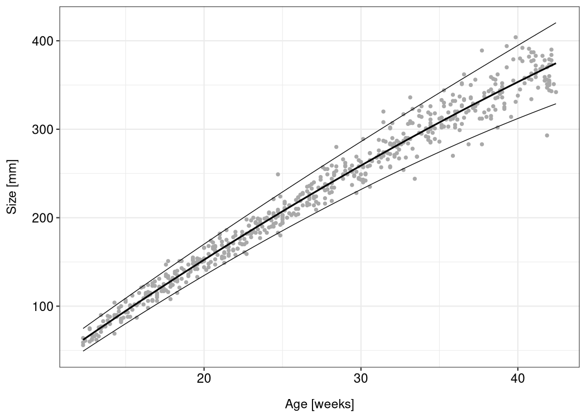

<!-- README.md is generated from README.Rmd. Please edit that file -->

# lmls

<!-- badges: start -->

[](https://github.com/hriebl/lmls/actions)
<!-- badges: end -->

*lmls* is an R package which deals with linear models for location and
scale. Those models are multi-predictor regression models with
explanatory variables for the mean (= the location) and the standard
deviation (= the scale) of a normally distributed response variable.
They are a special case of generalized additive models for location,
scale and shape (GAMLSS), discussed by Rigby and Stasinopoulos
(<https://doi.org/10.1111/j.1467-9876.2005.00510.x>).

The *lmls* package provides functions for maximum likelihood and Markov
chain Monte Carlo (MCMC) estimation, a parametric bootstrap algorithm,
and diagnostic plots. It was written for the “Advanced Statistical
Programming” course at the University of Göttingen. The source code is
made available on GitHub as an accessible introduction to some
computational aspects of location-scale regression, and as a basis for
the implementation of additional inference algorithms and model
extensions.

## Installation

You can install the development version of *lmls* from
[GitHub](https://github.com) with:

``` r
# install.packages("remotes")
remotes::install_github("hriebl/lmls")
```

The [CRAN](https://CRAN.R-project.org) release is in preparation.

## Example

The *lmls* package comes with the *abdom* dataset (which it borrows from
the *gamlss.data* package). The dataset consists of only two variables:
the size of 610 fetuses (as measurements of their abdominal
circumference taken from ultrasound scans) and their gestational age
ranging from 12 to 42 weeks.

To estimate an LMLS with a quadratic effect of the babies’ age on their
average size and a linear effect on the log-standard deviation, run this
code:

``` r
library(ggplot2)
library(lmls)

m <- lmls(y ~ poly(x, 2), ~ x, data = abdom)
```

You can now use *ggplot2* to visualize the model:

``` r
df <- abdom
df$mu <- predict(m, type = "response", predictor = "location")
df$sigma <- predict(m, type = "response", predictor = "scale")
df$upper <- df$mu + 1.96 * df$sigma
df$lower <- df$mu - 1.96 * df$sigma

ggplot(df, aes(x, y)) +
  geom_point(color = "darkgray", size = 1) +
  geom_line(aes(y = mu), size = 0.7) +
  geom_line(aes(y = upper), size = 0.3) +
  geom_line(aes(y = lower), size = 0.3) +
  xlab("Age [weeks]") +
  ylab("Size [mm]")
```



## Vignette

For more details, see the package vignette.
